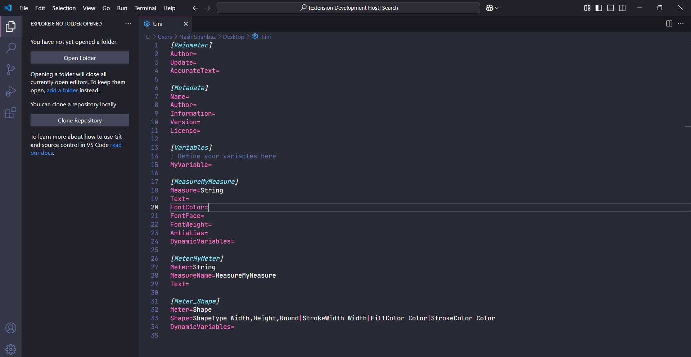

# RainSyntax for Visual Studio Code

RainSyntax  is a powerful VS Code extension tailored for Rainmeter enthusiasts, providing an intuitive environment that streamlines skin creation, reduces errors, and boosts productivity by offering tools specifically designed for Rainmeter's unique scripting needs. It provides syntax highlighting, code snippets, and a sleek theme to enhance your Rainmeter skin development experience.

---

## Features 🌟

- **Syntax Highlighting**: Tailored specifically for Rainmeter, it highlights key Rainmeter-specific syntax elements like sections, measures, and bangs, ensuring you can quickly identify and debug your code.
- **Snippets**: Quickly insert commonly used Rainmeter code blocks and configurations.
- **RainSyntax Theme**: A custom theme designed for a visually appealing and distraction-free coding experience.
- **Auto-Refresh**: Automatically refresh your Rainmeter skins when saving `.ini` , `.inc `or `.nek` files.
- **Color-Picker** : Provide the Color-Picker for the Hex and RGB values.
- **Enhanced Productivity**: Optimized for seamless Rainmeter skin development.

---

## Explain Features 🌟

### 1. **Snippets and Syntax Highlighting**

- **Snippets**: Snippets for commonly used Rainmeter code structures are available when working with `.ini`, `.inc`, and `.nek` files.
- **Syntax Highlighting**: Rainmeter-specific keywords and syntax are color-coded for easier readability.

### 2. **Auto-Refresh on Save**  🔄

When enabled, the extension will automatically refresh your Rainmeter skin whenever an `.ini`, `.inc`, and `.nek` file is saved.

- By default, auto-refresh is **enabled**. To change the setting, use the **Command Palette**.

### 3. **Completion Item Provider**  ✏️

The extension provides auto-completion for specific properties in `.ini`, `.inc`, and `.nek` files.
When typing these properties, you will receive suggestions for possible values.

### 4. **Color Picker Support** 🎨

The extension also supports color highlighting for RGB and HEX values in `.ini`, `.inc`, and `.nek` files.

- **Supported Formats**:

  - **RGB**: `255,255,255`
  - **HEX**: `#FFFFFF`

  When you hover over a color, the color picker is activated, allowing you to select a new color.

---

## Installation 🛠️

1. Open Visual Studio Code.
2. Go to the Extensions view by clicking on the Extensions icon in the Activity Bar on the side of the window or pressing `Ctrl+Shift+X`.
3. Search for `RainSyntax`.
4. Click "Install" to add it to your editor.

---

## How to Use 🚀

1. Install the extension.
2. Open a Rainmeter `.ini`, `.inc`, and `.nek` file or any Rainmeter-related file.
3. Enjoy automatic syntax highlighting and make use of the snippets by typing a keyword and pressing `Tab`.
4. Enable the RainSyntax Theme by selecting it from the VS Code theme settings.

---

## Settings ⚙️

You can configure the following settings in your `settings.json` file:


**rainSyntax.autoRefreshOnSave**: Automatically refresh Rainmeter skins when saving   `.ini`, `.inc`, and `.nek` files.

- Type: `boolean`
- Default: `true`
- Example:

```json
"rainSyntax.autoRefreshOnSave": true
```


**rainSyntax.rainmeterPath**: Path to the Rainmeter executable.

- Type: `string`
- Default: `C:\\Program Files\\Rainmeter\\Rainmeter.exe`
- Example:

```json
"rainSyntax.rainmeterPath": "C:\\Program Files\\Rainmeter\\Rainmeter.exe"
```

**3.rainSyntax.refreshMode:** Change the Refresh Mode.

* Type: `string`
* Default : `All`
* Example
* 

```json
"rainSyntax.refreshMode": "all"
```


```json
"rainSyntax.refreshMode": "specific"
```


### Update Settings via Command Palette 🎛️

You can update the settings directly from the Command Palette:

1. **Toggle Auto Refresh**: Use the command **"Toggle AutoRefresh Rainmeter"** to enable or disable auto-refresh for  `.ini`, `.inc`, and `.nek` file saves.
2. **Change Rainmeter Executable Path**: Use the command **"Change Rainmeter Path"** to input a new path to your Rainmeter executable.

### Color Picker Support 🎨

The extension uses the `provideDocumentColors` method to detect color values in RGB or HEX format. When you hover over any color value in the  `.ini`, `.inc`, and `.nek` file, a color preview is shown, and you can use the color picker to modify the color.

- **RGB Format**: `255,255,255`
- **HEX Format**: `#FFFFFF`

Both formats will be converted and presented in the editor as clickable color information, allowing for color selection and easy editing.

### Example of Color in `.ini` File

```ini
[Variables]
MyColor=255,0,0
MyHexColor=#FF5733
```

### Auto-Refresh on Save 🔄

RainSyntax offers automatic skin refresh when `.ini`, `.inc`, or `.nek` files are saved. You can customize the refresh behavior and Rainmeter executable path through the extension's settings.

#### Features:

1. **Auto-Refresh on Save**:

   - Automatically refresh all Rainmeter skins or just the specific skin being edited based on the selected mode.
   - Enabled by default, but can be toggled via the Command Palette (`Toggle AutoRefresh Rainmeter`).
2. **Refresh Modes**:

   - `all`: Refresh all Rainmeter skins.
   - `specific`: Refresh only the skin currently being edited.

   Change this mode through the Command Palette (`Rainmeter Refresh Mode`).

#### Commands:

- **Toggle AutoRefresh**: Quickly enable or disable auto-refresh.
- **Change Refresh Mode**: Switch between refreshing all skins or the specific skin.

#### Settings:

- **`rainSyntax.autoRefreshOnSave`**: Toggle automatic refreshing of skins on file save.
- **`rainSyntax.refreshMode`**: Choose between `all` (default) or `specific` refresh modes.

> ⚙️ Ensure Rainmeter is properly installed and its path is correctly set to use these features.

## Preview 👀

### Syntax Highlighting

This feature provides a clear and structured visual representation of your Rainmeter code, making it easier to identify elements like sections, variables, and comments. Below is a snapshot to give you an idea of its appearance in action.

<div align="center">
    

### Code Snippets 📑

<div align="center">
    

### RainSyntax Theme

<div align="center">
    

</div>
 </div>
  </div>


 
  

---

## Contribution 🤝

Feel free to contribute to the development of RainSyntax! Follow these steps:

1. Fork this repository.
2. Clone the forked repository to your local machine.
3. Make your changes and test them.
4. Create a pull request explaining your changes.

---

## Feedback and Support 📩

If you encounter any issues or have suggestions for improvement, please [open an issue](https://github.com/NSTechBytes/rainsyntax/issues) on GitHub. Your feedback is invaluable!

---

## License 📜

This project is licensed under the MIT License - see the [LICENSE](LICENSE) file for details.

---

### Thank You for Using RainSyntax! 🙌

Make your Rainmeter skin development enjoyable and efficient with RainSyntax!
